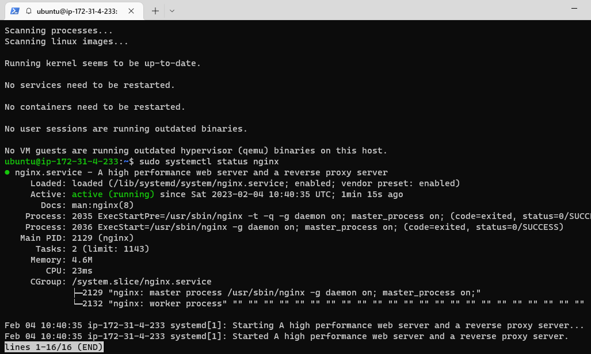
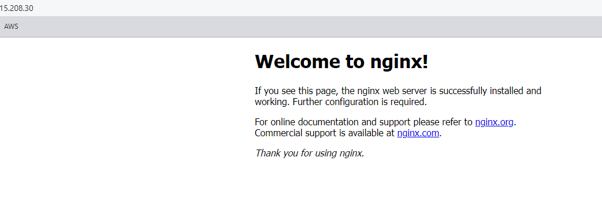
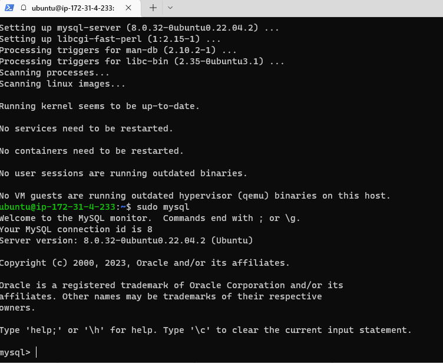
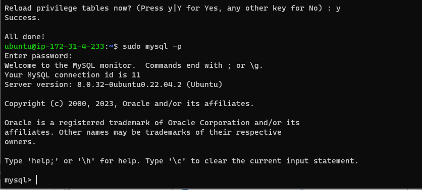
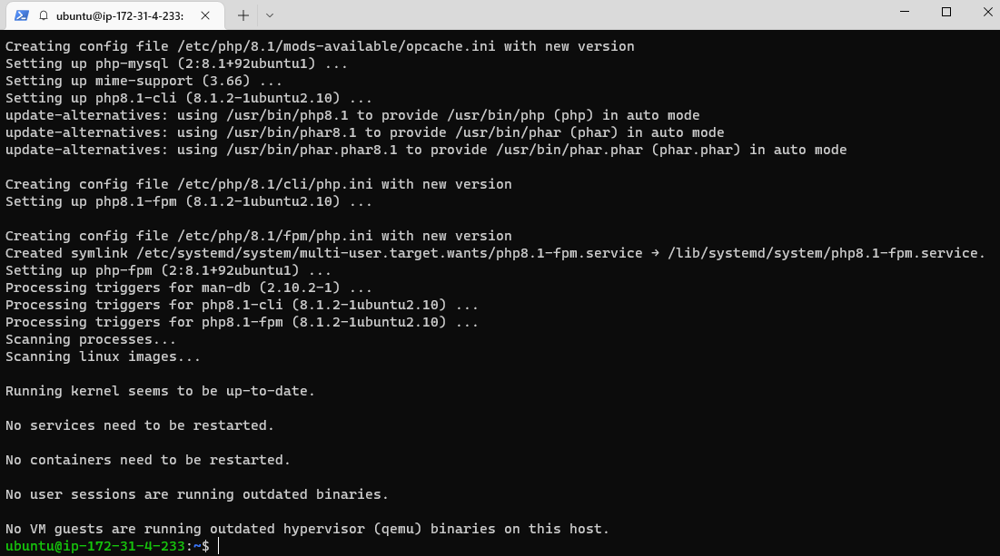

# WEB STACK IMPLEMENTATION ( LEMP STACK )

### - Developing Web Solutions using LEMP stack

### Preparing Prerequisites :
### Create a new EC2 instance of t2.nano family with ubuntu server 22.04 LTS (HVM) image.

### SSH into the created EC2 instance
`ssh -i "abass2-ec2.pem" ubuntu@ec2-3-15-208-30.us-east-2.compute.amazonaws.com`

# STEP 1 - INSTALL NGINX WEB SERVER
## Update the Server's package index
`sudo apt update`
`sudo apt install nginx`

## Verify NGINX installation
`sudo systemctl status nginx`

## Test the NGINX server from the web
`http://<Public-IP-Address>:80`

# STEP 2 - INSTALL MYSQL

## Install MYSQL using 'apt'
`$ sudo apt install mysql-server`

## Login into MySQL console
`$ sudo mysql`

## Interactive script to configure password
`$ sudo mysql_secure_installation`

## test the login into MySQL Console
`$ sudo mysql -p` 

# STEP 3 - INSTALL PHP
### Nginx and MySQL both installed to serve content and store data respectively. Next, Install PHP to process code and generate dynamic content for the web server 

`$ sudo apt install php-fpm php-mysql`

