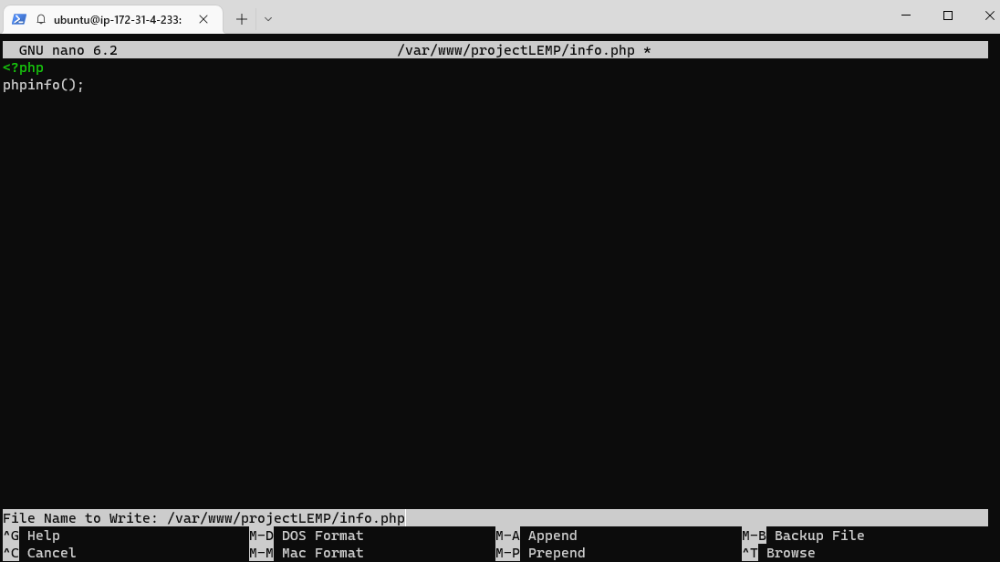

# WEB STACK IMPLEMENTATION ( LEMP STACK )

### - Developing Web Solutions using LEMP stack

### Preparing Prerequisites :
### Create a new EC2 instance of t2.nano family with ubuntu server 22.04 LTS (HVM) image.

### SSH into the created EC2 instance
`ssh -i "abass2-ec2.pem" ubuntu@ec2-3-15-208-30.us-east-2.compute.amazonaws.com`

# STEP 1 - INSTALL NGINX WEB SERVER
## Update the Server's package index
`sudo apt update`
`sudo apt install nginx`

## Verify NGINX installation
`sudo systemctl status nginx`

## Test the NGINX server from the web
`http://<Public-IP-Address>:80`

# STEP 2 - INSTALL MYSQL

## Install MYSQL using 'apt'
`$ sudo apt install mysql-server`

## Login into MySQL console
`$ sudo mysql`

## Interactive script to configure password
`$ sudo mysql_secure_installation`

## test the login into MySQL Console
`$ sudo mysql -p` 

# STEP 3 - INSTALL PHP
### Nginx and MySQL both installed to serve content and store data respectively. Next, Install PHP to process code and generate dynamic content for the web server 

`$ sudo apt install php-fpm php-mysql`

# STEP 4 - CONFIGURE NGINX TO USE PHP PROCESSOR
### Create root web directory for your domain
`$ sudo mkdir /var/www/projectLEMP`
### Assign ownership of the directory with $USER env variable
`sudo chown -R $USER:$USER /var/www/projectLEMP`
### Open a new config file in Nginx's sites-available directory using 'nano'
`sudo nano /etc/nginx/sites-available/projectLEMP`

### Activate the config by linking to the config file from Nginx's sites-enabled directory
`sudo ln -s /etc/nginx/sites-available/projectLEMP /etc/nginx/sites-enabled/`
### Test configuration for syntax errors
`$ sudo nginx -t`

### Disable default Nginx host that is currently configured to listen on port 80:
`sudo unlink /etc/nginx/sites-enabled/default`

### Reload Niginx to apply changes
`sudo systemctl reload nginx`

### Create an index.html file in the web root /var/www/projectLEMP
`sudo echo 'Hello LEMP from hostname' $(curl -s http://169.254.169.254/latest/meta-data/public-hostname) 'with public IP' $(curl -s http://169.254.169.254/latest/meta-data/public-ipv4) > /var/www/projectLEMP/index.html`

### Access the website via IP address
`http://<Public-IP-Address>:80`

### The LEMP (Linux, Nginx, MySQL, PHP) stack is now configured.

# STEP 5 - TESTING PHP WITH NGINX

### Create a test php file in the document root
`sudo nano /var/www/projectLEMP/info.php`

### Access the file on the web using the public IP in the Nginx config file

### Remove file created because of potential sensitive information leak about the php server
`sudo rm /var/www/your_domain/info.php`

# STEP 6 - RETRIEVING DATA FROM MYSQL DB USING PHP

### Connect to MySQL
`$ sudo mysql`

### Create a new db 
`CREATE DATABASE test_db;`

### Create new user and grant full privileges on db 
`CREATE USER 'test_user'@'%' IDENTIFIED WITH mysql_native_password BY 'test_password';`

### Grant permissionover the test_db datatbase:
`GRANT ALL ON test_database.* TO 'test_user'@'%';`

### Confirm if user now has the permissions
`$ mysql -u test_user -p`

### NB: This will prompt a password used when creating the test user.

### Confirm access to database
`SHOW DATABASES`

### Create a test table 
`CREATE TABLE example_database.todo_list` `(`
  `item_id INT AUTO_INCREMENT,`
  `content VARCHAR(255),`
  `PRIMARY KEY(item_id));`

### Insert few rows of data in to the table
`INSERT INTO example_database.todo_list (content) VALUES ("First important item");`

### Confirm data is saved to the table
`SELECT * FROM example_database.todo_list;`

### Create PHP script to connect to MySQL usinf nano:
`nano /var/www/projectLEMP/todo_list.php`

### Copy the following line of codes into the todo_list.php script

### Access the page in the web via the public IP address
`http://<Public_domain_or_IP>/todo_list.php`

 
 ### PHP environment setup is now complete and ready to connect with MySQL server

